# Config Microsoft Power BI to connect with Amazon Athena

## Prerequisite
1. [AWS account](https://aws.amazon.com/)
2. [Permissions to use Athena](https://docs.aws.amazon.com/athena/latest/ug/policy-actions.html)
3. [Power BI desktop](https://powerbi.microsoft.com/en-us/desktop/)
    
---
## Instruction

### 1. Amazon Athena ODBC driver

#### 1.1 Download and install Amazon Athena ODBC driver

Download on this [link](https://docs.aws.amazon.com/athena/latest/ug/connect-with-odbc.html)

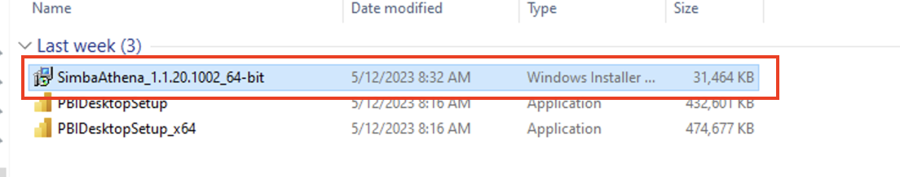

Install Amazon Athena ODBC driver

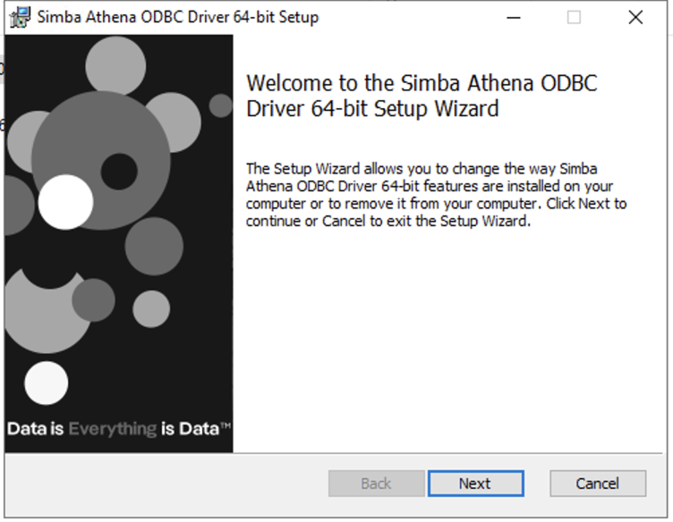

#### 1.3 Setup ODBC Data Sources

Search for `ODBC Data Sources`

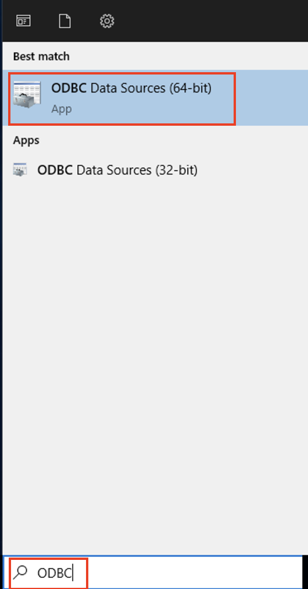

On `System DNS` tab then click `Add...`

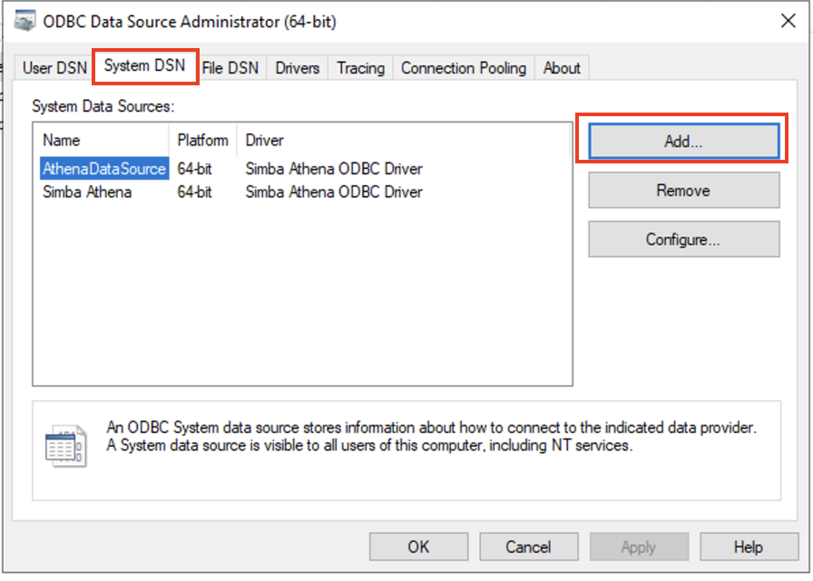

Select Name `Simba Athena ODBC Driver` then click `Finish`

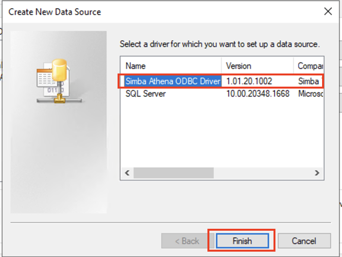

On `Simba Athena ODBC Driver DSN Setup` Input following information

Data Source Name: `MyTestDataSource` (Your Data Source Name)

AWS Region: `us-east-1`

S3 Output Location: `s3://<S3-BUCKET>/`

then click `Authentication Options...`

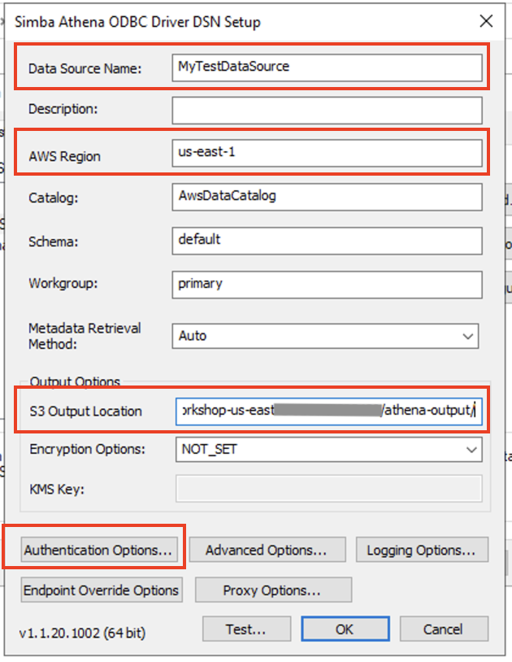

Authentication Type: `IAM Credentials`

User: `<AWS_ACCESS_KEY_ID>` (Your AWS Access Key ID)

Password: `<AWS_SECRET_ACCESS_KEY>` (Your AWS Secret Access Key)

Session Token: `<AWS_SESSION_TOKEN>` (Your AWS Session Token)

then click `OK`

Test connection by click `Test...`

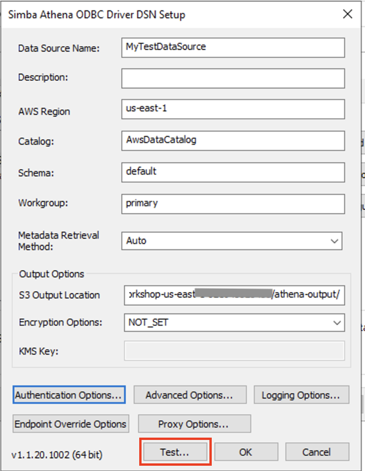

Message shows `SUCESS!` then click `OK`

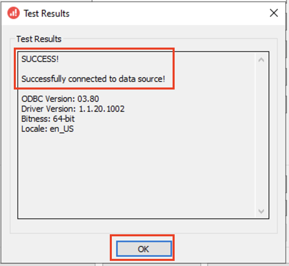

Click `OK` to finish setup ODBC Data Source

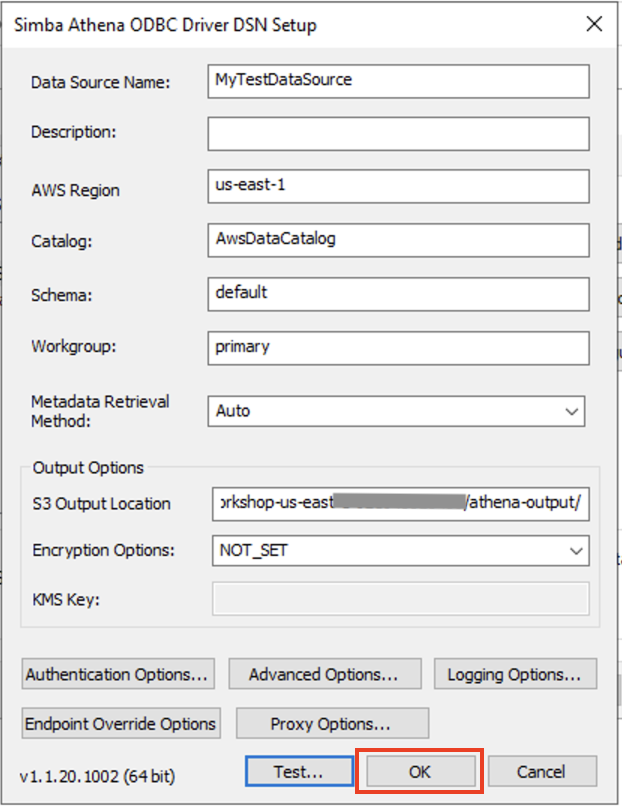

---

### 2. Power BI

#### 2.1 Get data

Open `Power BI`. In `Home` tab, click `Get data`

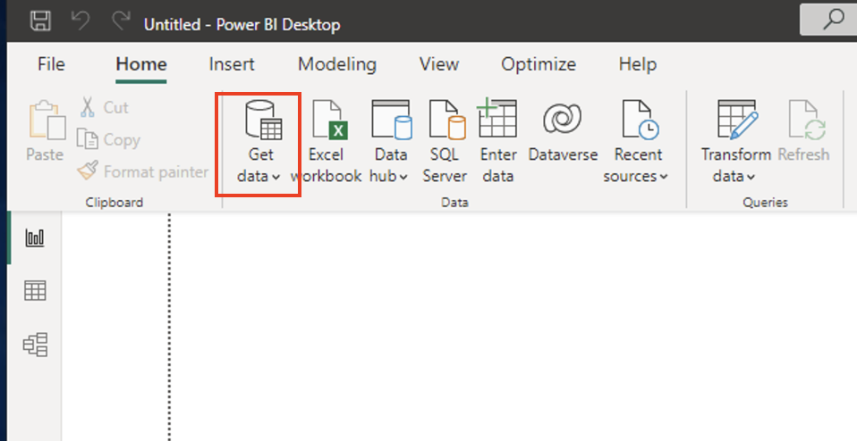

Search for `Athena` and click `Connect`

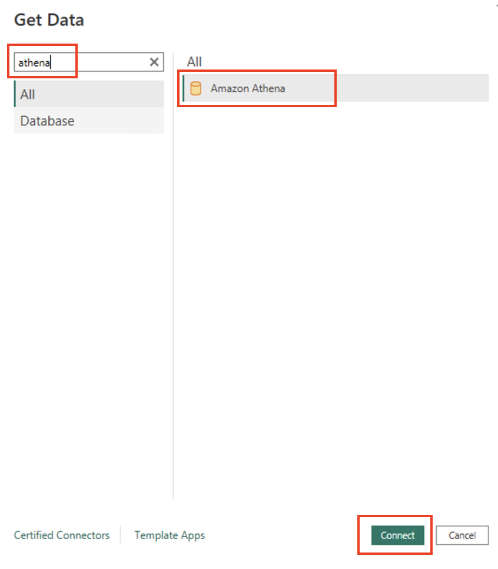

DSN: `MyTestDataSource` (Your Data Source Name)

Data Connectivity mode: `DirectQuery`

Click `OK`

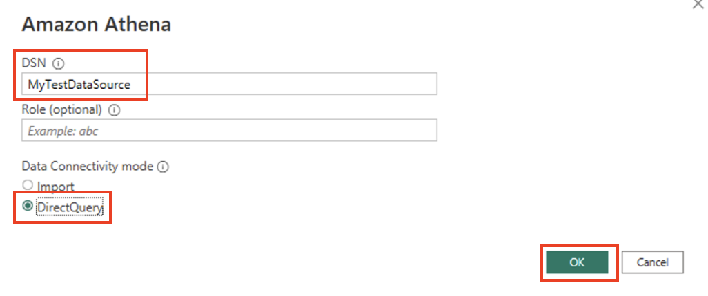

Select `Use Data Source Configuration` then click `Connect`

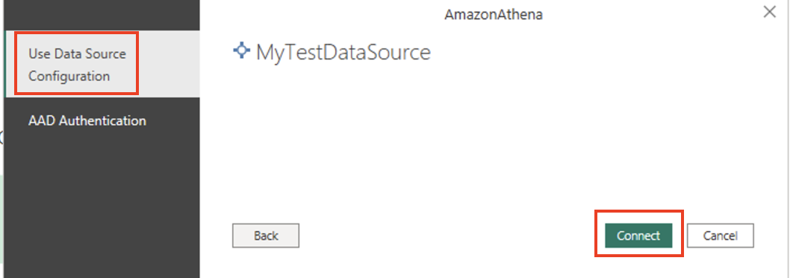

Navigator will show up then expand datasource, database, and select table then click `Load`

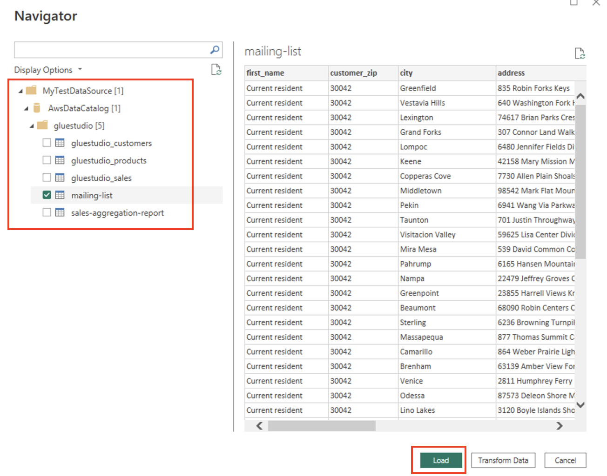

On `Visualizations` tab, select `Table`

On `Data` tab, select column that you want to show

You will notice that data is showing on dashboard.

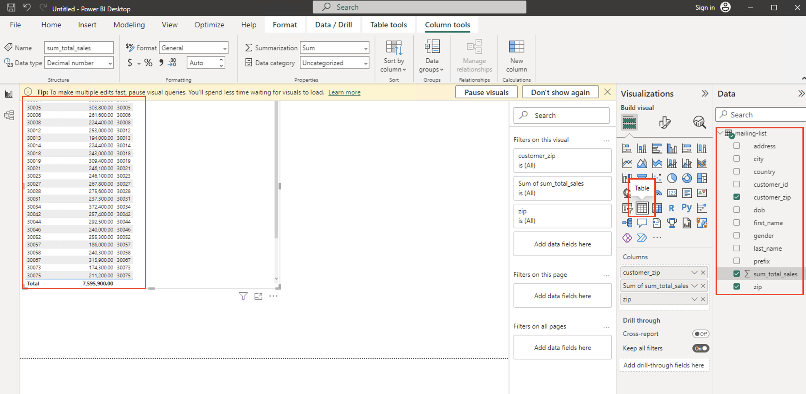

---